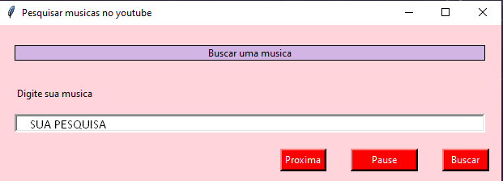
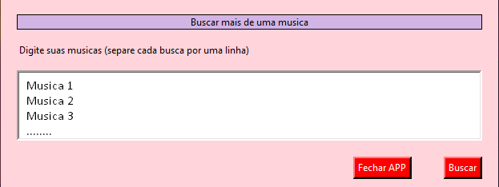

# Bem vindo ao repositório Tkinter + Selenium para reproduzir musicas no Youtube!

Você escuta muitas musicas no youtube? já pensou em ter todas elas rodando em ordem no Youtube pulando os anúncios para você?

Essa aplicação cria um **interface gráfica** para o usúario digitar sua musica (ou suas varias musicas), e deixar rodando de segundo plano.

Sem a preocupação de lidar com os anúncios.

Redes Sociais:
* [Site](https://portfolio-claudio.herokuapp.com)
* [Instagram](https://www.instagram.com/claudiogfez/)
* [Linkedin](https://www.linkedin.com/in/clcostaf/)


## Instalação

1. Primeiramente você pode clonar este repositório.

```
$ git clone https://github.com/clcosta/YT_Player-Selenium-Tkinter.git
```

2. Agora a instalação das bibliotecas

```
pip install -r requirements.txt
```

## How to use ( Como Utilizar )

1. Com tudo já instalado é só executar o código!
```
python main.py
```

 * Exemplo 1° Parte:
	
	  

 * Exemplo 2° Parte:  

	


# Autor
| [<br><sub>@clcostaf</sub>](https://github.com/clcostaf) |
| :---: |
